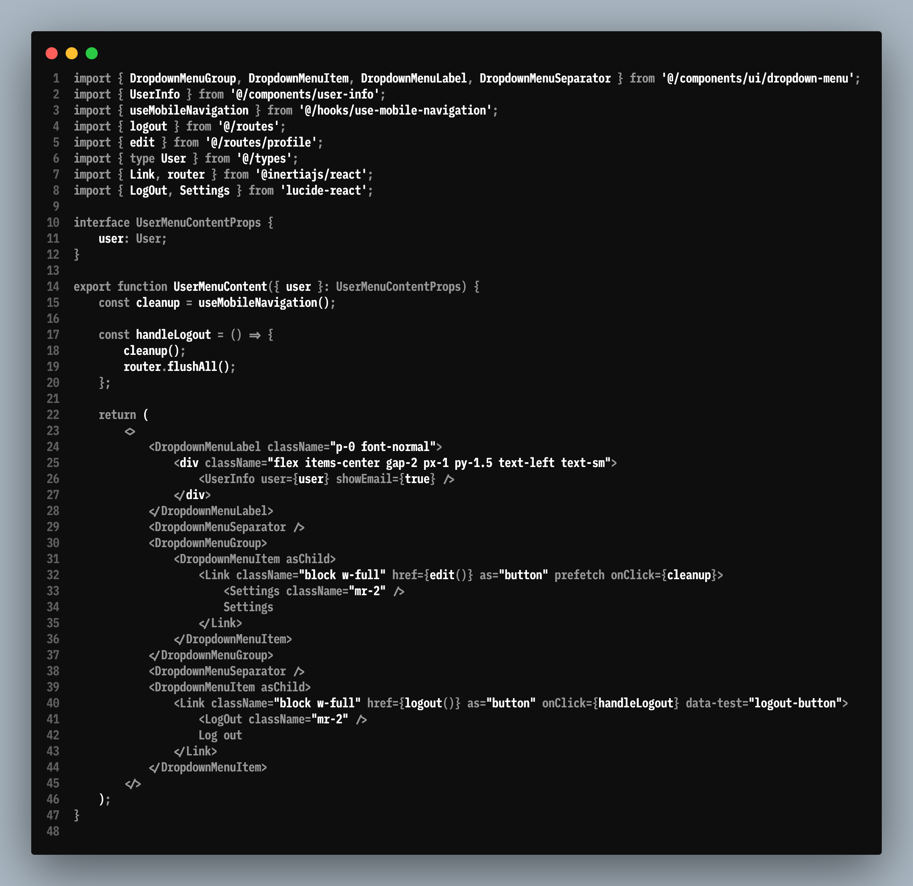

# Block Mono Font

A programming font based on IBM Plex Mono, enhanced for improved readability and developer experience.

## Features

### Increased Height
- Extended character height for better visual distinction
- Improved readability in code editors and terminals
- Maintains the professional appearance of IBM Plex Mono while providing better legibility

### Ligatures
- Comprehensive ligature support for common programming patterns
- Includes arrows (→, ←, ↑, ↓), comparisons (==, !=, <=, >=), and logical operators (&&, ||)
- Elegant rendering of common code constructs like `->`, `=>`, `/*`, `*/`, and more

### Nerd Fonts Support
- Complete Nerd Fonts integration with thousands of glyphs
- Includes icons for:
  - Development tools (Git, Node.js, Python, etc.)
  - File type indicators
  - Powerline symbols
  - Custom glyphs for various programming languages and frameworks

## Font Showcase

## License

This font is based on IBM Plex Mono and follows its license terms. Please refer to the [IBM Plex Mono license](https://github.com/IBM/plex#license) for more information.

## Acknowledgments

- Based on [IBM Plex Mono](https://github.com/IBM/plex)